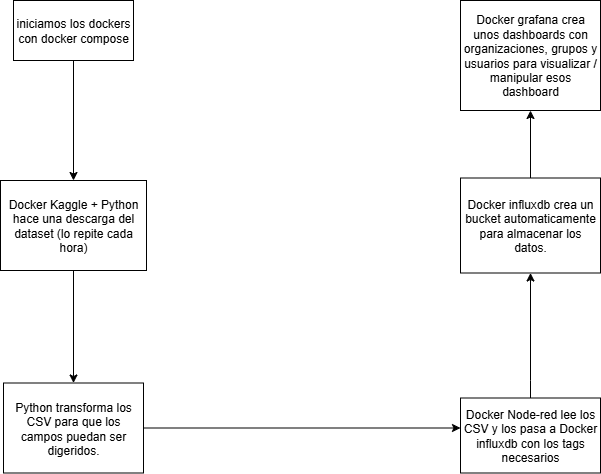

# Reto 0 - Grupo 5
## Programación de Inteligencia Artificial
En este apartado tenemos varios containers con imagenes de Node-red, InfluxDB, Grafana y python + kaggle.

El flujo de trabajo es así:

