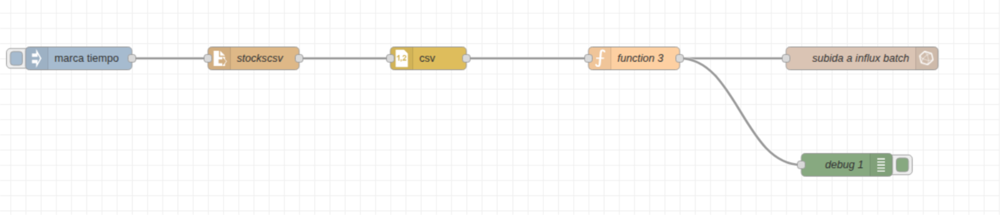
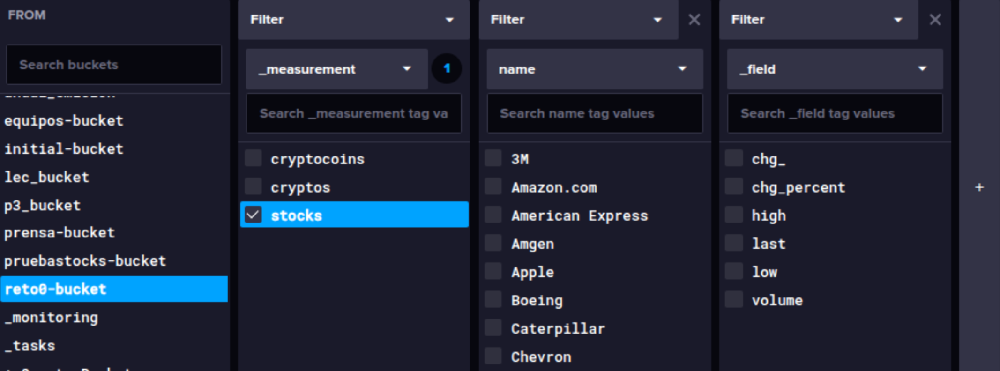
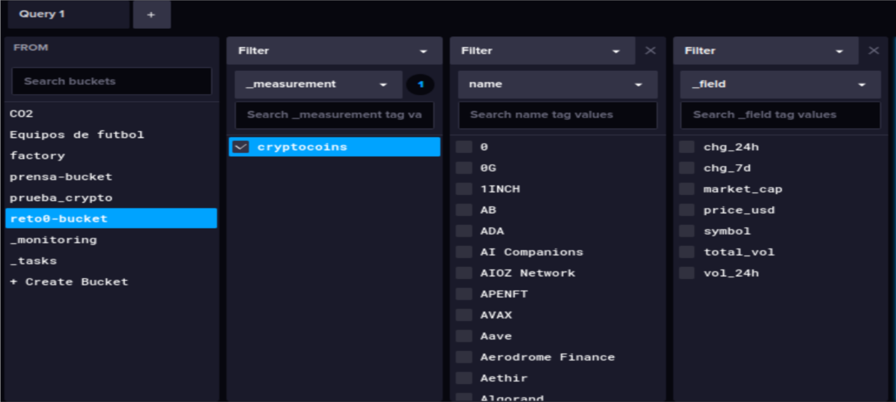
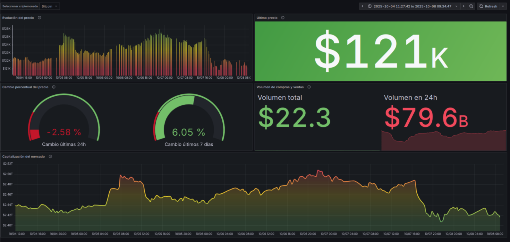

# BDA - Big Data & Aplicado

## 1. Manipulación y Análisis de Datos

### Tarea 1: Cargar conjuntos de datos y aplicar transformaciones
**Descripción:**  
En primer lugar, accedimos a una página fiable que nos proporcionaba datos sobre el mercado financiero, nos descargamos los ficheros (stocks.csv y cryptocurrency.csv) y realizamos la limpieza de los ficheros para su corrercta subida de datos a influxDB. La primera subida fué a través de node-RED y la segunda a través de pandas.

**Herramientas utilizadas:**  

- Node-RED  
- Python (pandas)  
- InfluxDB  
- Grafana  
---

### Tarea 2: Configurar flujos en Node-RED
**Descripción:**  
El primer archivo lo cargamos a través de Node-RED. Este flujo realiza la lectura de un archivo CSV con datos de acciones, los procesa y los envía a una base de datos **InfluxDB**.

- **timestamp:** Inicia el flujo automáticamente.  
- **stocks.csv:** Lee el archivo CSV con los datos bursátiles.  
- **csv:** Convierte el contenido del CSV en objetos JSON.  
- **function 3:** Transforma los datos en puntos para InfluxDB.  
- **subida a influx batch:** Envía los puntos a la base de datos InfluxDB.  

**Resultados / Comprobaciones:**  

### Tarea 3: Subida de datos desde Pandas
**Descripción:** 
El csv de las criptomonedas lo cargamos a través de pandas. Primero, nos aseguramos de que la limpieza de archivo esté bien realizada y después subimos los datos a influxDB. Teniendo en cuenta que tiene que coincidir el bucket de InfluxDB y el creado en Pandas. Además de crear el measurement y de clasificar las criptomonedas por el tag 'name'.

---

## 2. Datos en InfluxDB

### Tarea 1: stocks.csv

**Configuración:**  

- Bucket: livemarket 
- Measurement: stocks 
- Fields: last, high, low, chg_, chg_percent, volume.
- Tags: name 

**Resultado:**  

### Tarea 2: cryptocurrency.csv

**Configuración:**  
- Bucket: livemarket
- Measurement: cryptos 
- Fields: symbol,price_usd,vol_24h,total_vol,chg_24h,chg_7d,market_cap 
- Tags: name

**Resultado:**  

---

### Tarea 3: Generación de tokens de lectura y escritura
**Descripción:**  
Hicimos Tokens de lectura para grafana, ya que es el que muestra los datos, y Tokens de escritura para Pandas y Node-RED, que son los que realizan las subidas de datos.

### Tarea 3: Uso de tags para optimización
**Descripción:**  
En nuestro caso el tag que utilizamos fué para clasificar las distintas criptomonedas y empresas de las acciones por su nomnbre 'name'. Esto nos permitía tener una mejor organización de los datos para luego poder visualizarlos en grafana.

## 2. Visualización en Grafana
Para poder realizar una investigación precisa y así anticiparnos a los cambios recurrentes que sufren las acciones y las criptomonedas, la mejor manera es poder visualizar los datos a través de gráficos. Muestran la evolución del precio en el tiempo y distintas comparaciones con las que nos permiten hacer todo esto.

**Gráficos stocks:**  

---
**Gráficos cryptos:**  

---