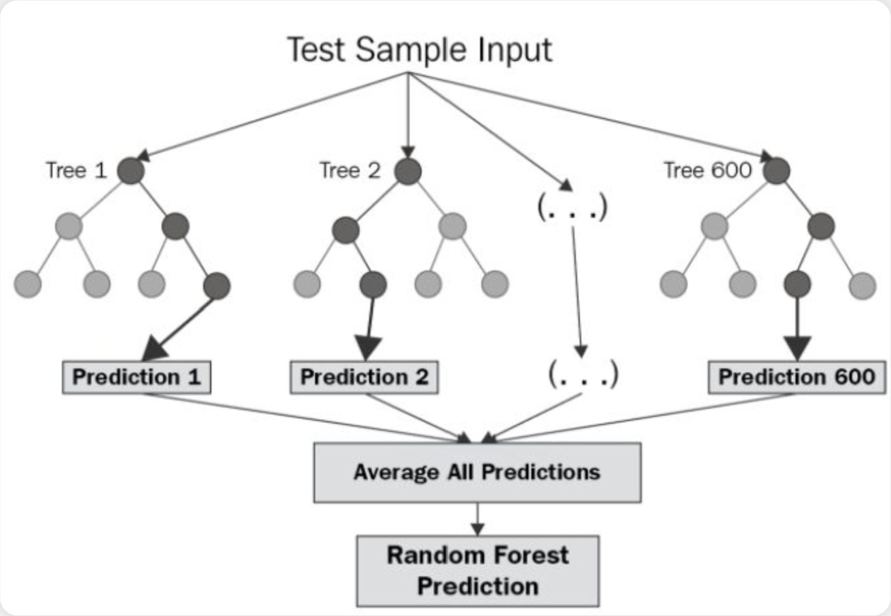

# MIA - Modelos de Inteligencia Artificial

## 1. Definir el proyecto
- **¿Por qué?**  
Para abordar estos desafíos, proponemos la construcción de una Plataforma Integral de Business Intelligence, centrada en un motor de  IA diseñado específicamente para optimizar la planificación de la demanda.

- **¿Para qué?**  
**Solución a los problemas**
- BBDD Centralizada: Unificar fuentes de datos en un único repositorio para garantizar la calidad de la información.
- Motor Predictivo de Ventas: Desarrollaremos un modelo de Machine Learning como núcleo de la plataforma. 
- Visualización Estratégica: Crearemos dashboards interactivos y personalizados para visualizar las predicciones del modelo

---

## 2. Elección de los modelos
Hemos decidido centrar nuestra solución en un modelo de Predicción de Ventas.

### 2.1 Descripción del modelo
El modelo sera un Random Forest Regressor.Se trata de un método avanzado de aprendizaje supervisado que, en lugar de usar un solo árbol de decisión, combina las predicciones de múltiples árboles. Este enfoque es mucho más preciso y estable.
Resiste al sobreajuste, lo que garantiza que el modelo será fiable para predecir con la mayor precisión posible el volumen de ventas futuro...

### 2.2 Tipo de datos Entrenamiento y ajuste
El modelo se alimentará de un conjunto de datos históricos rico y variado:Datos Transaccionales:  Registros de ventas pasadas, incluyendo fecha, producto...Información de Marketing: Datos sobre promociones, descuentos e inversión publicitaria para entender su impacto.Calendario y Eventos: Días festivos, temporadas, eventos...

Primero, limpiaremos y transformaremos los datos brutos para crear nuevas variables que aporten valor predictivo. División de los datos:
- Entrenamiento (70%): Se usará para aprender los patrones de venta.
- Validación (15%): Para ajustar y optimizar la configuración del modelo sin "contaminar" los datos de prueba.
- Prueba (15%): Datos recientes que el modelo nunca ha visto.

