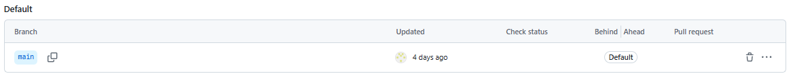
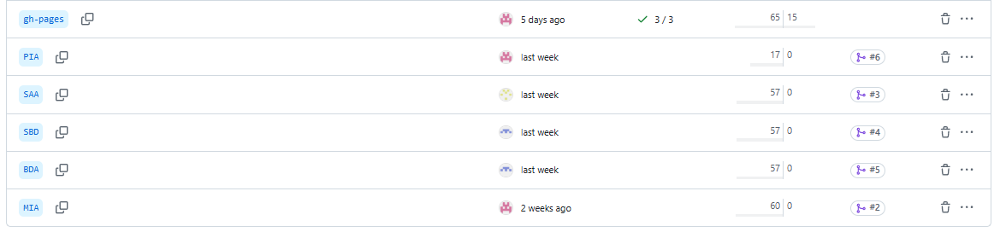

# PIA - Programación de Inteligencia Artificial

## Productos a entregar

- Contenedor para adquisición de datos  
- Contenedor para creación, configuración y carga de datos en la BBDD relacional  
- Contenedor para creación, configuración y carga de datos en la BBDD no relacional  

## Productos entregados

- Contenedor para adquisición de datos y subida de datos (Python + Kaggle).
- Contenedor alternativo para subida de datos (Node-red).
- Contenedor para creación, configuración y carga de datos en la BBDD relacional (Grafana).
- Contenedor para creación, configuración y carga de datos en la BBDD no relacional (InfluxDB).


## Tareas de Programación de IA

### 1️. Creación de repositorios del reto
**Descripción:**  
Para este proyecto se ha creado un solo repositorio y varias ramas, 1 por cada apartado.

**Herramientas utilizadas:** 

- GitHub
- DockerHub
- KaggleHub
- VirtualBox
- Python
- Node-Red
- Grafana
- InfluxDB

**Resultado:**  
Rama Principal:


Ramas creadas:



### 2️. Scripts de generación y automatización de despliegues
**Descripción:**  
- Script de Python inicial que llama al resto de scripts la primera vez y cada 10 minutos.
   1. Script de Python que se descarga de Kagglehub un dataset, lo descomprime y borra el .zip.
   2. 2 Scripts de Python que leen los CSVs y corrijen las columnas a sus debidas unidades.
   3. Script de Python que le pide a influx que cree una API token nueva de escritura.
   4. Script de Python que utiliza el API token para subir los datos de un CSV a influx.

**Lenguajes utilizados:**  

- Python
- Bash  

**Docker Compose:**
El docker compose sigue estos pasos:

1. Inicia Influx.

2. Inicia Python-Kaggle y ejecuta todos los scripts en el orden anteriormente especificado.

3. Inicia Grafana.

4. Inicia Node-red.

```
services:
  python-kaggle:
    build:
      context: ./subida_y_procesamiento_datos
    container_name: python_kaggle_runner
    depends_on:
      - influxdb
    volumes:
      - ./subida_y_procesamiento_datos/contenido:/app/contenido
      - ./kaggle.json:/root/.kaggle/kaggle.json:ro
    environment:
      - KAGGLE_CONFIG_DIR=/root/.kaggle
    working_dir: /app
    command: python contenido/actualizador.py

  influxdb:
    image: influxdb:2.7
    container_name: influxdb
    ports:
      - "8086:8086"
    volumes:
      - influxdb_data:/var/lib/influxdb2
    environment:
      - DOCKER_INFLUXDB_INIT_MODE=setup
      - DOCKER_INFLUXDB_INIT_USERNAME=cryptobro
      - DOCKER_INFLUXDB_INIT_PASSWORD=criptobro12345
      - DOCKER_INFLUXDB_INIT_ORG=Cryptobro_Together_Strong
      - DOCKER_INFLUXDB_INIT_BUCKET=livemarket
      - DOCKER_INFLUXDB_INIT_RETENTION=365d
      - DOCKER_INFLUXDB_INIT_ADMIN_TOKEN=solo_para_cryptobros

  grafana:
    image: grafana/grafana:latest
    container_name: grafana
    depends_on:
      - python-kaggle
    ports:
      - "3000:3000"
    volumes:
      - ./subida_y_procesamiento_datos/contenido/grafana_dashboard:/etc/grafana/provisioning/dashboards
      - ./subida_y_procesamiento_datos/contenido/grafana_datasource:/etc/grafana/provisioning/datasources
      - grafana-storage:/var/lib/grafana
    environment:
      - GF_SECURITY_ADMIN_USER=admin
      - GF_SECURITY_ADMIN_PASSWORD=admin
    restart: unless-stopped

  nodered:
    image: nodered/node-red:latest
    container_name: nodered
    build:
      context: ./subida_y_procesamiento_datos/contenido/nodered_data
    depends_on:
      - python-kaggle
    ports:
      - "1880:1880"
    volumes:
      - ./subida_y_procesamiento_datos/contenido/nodered_data:/data

volumes:
  influxdb_data:
  grafana-storage:
  nodered_data:
```