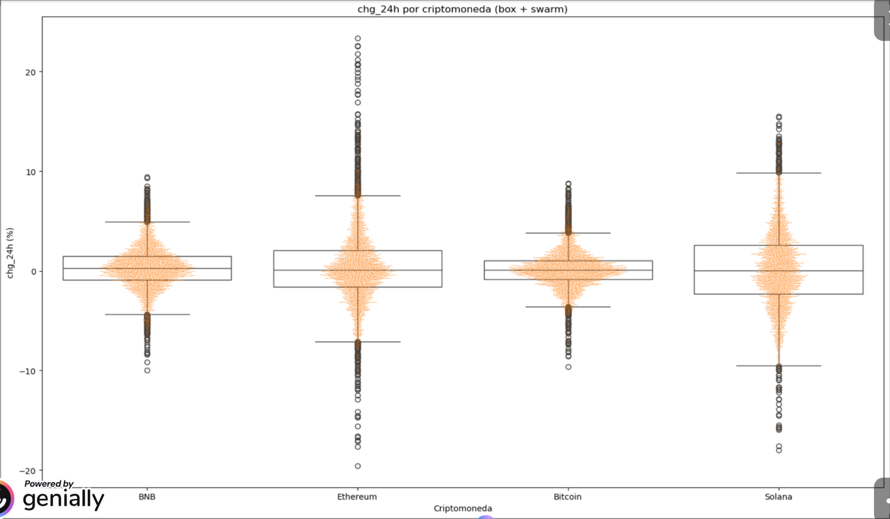
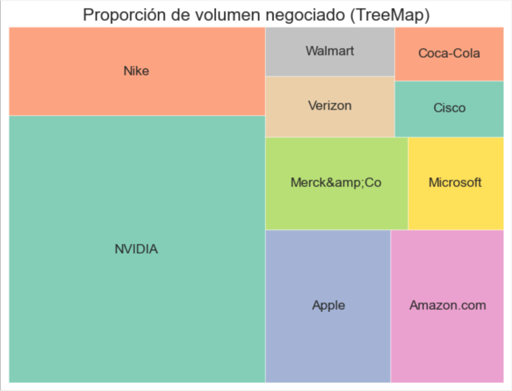
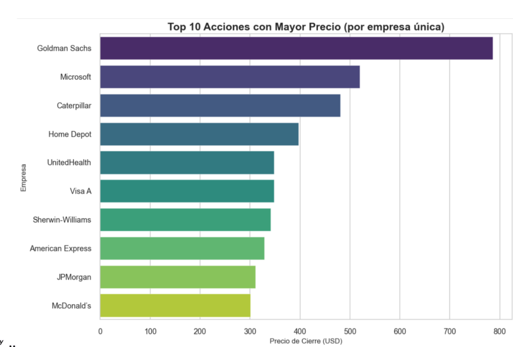

# SAA - Sistemas de Aprendizaje Automático

## Introducción
En esta asignatura se ha trabajado la **carga, exploración y visualización de datos** mediante librerías de Python, enfocándose en la comprensión, análisis y comunicación visual de la información. 

El objetivo principal ha sido **desarrollar habilidades en el manejo de datasets reales**, su representación gráfica y la interpretación de patrones relevantes para la toma de decisiones.

---

## 1️. Carga de Datos (Pandas)

### Tarea: Cargar archivos

**Objetivo:**  
Asegurar la correcta lectura de los datos, sin errores de formato, usando la librería **pandas**.

**Descripción:**  
Se visualizó el curso de YouTube “TUTORIAL SEABORN DESDE CERO”, con una duración aproximada de **38 minutos**, orientado al uso de **Seaborn** para mejorar la calidad y personalización de las gráficas en Python.

**Enlace al curso:**  
[Tutorial Seaborn desde Cero - Codificando Bits](https://www.youtube.com/watch?reload=9&v=4Ez4mbhIk_I&sttick=0)

**Aprendizajes clave:**

- Creación de gráficos estadísticos con `seaborn`.  
- Personalización de colores, estilos y temas.  
- Representación de distribuciones y relaciones entre variables.  
- Integración de Seaborn con Matplotlib.  
---

## 3. Visualización de Datos (Matplotlib y Seaborn)

### Generación de Visualizaciones

**Ejemplos de visualizaciones:**

- Gráfico de barras  
- Gráfico de líneas  
- Diagrama de dispersión  
- Histograma  
- Mapa de calor  

---

## Resultado

- El **gráfico de barras** permitió comparar los valores promedio por categoría.  
- El **diagrama de dispersión** ayudó a identificar correlaciones entre variables.  
- El **mapa de calor** reveló relaciones de dependencia y posibles patrones de agrupación.  

---

## 5️. Análisis y Reflexión sobre la Visualización de Datos

### Concepto General
La **visualización de datos** es la representación gráfica de la información para facilitar la comprensión de grandes volúmenes de datos.  

A través de gráficos, tablas y dashboards, se pueden identificar **tendencias, patrones y valores atípicos** de forma rápida y efectiva.

---

### Aplicación en Big Data
En el contexto de los **Big Data**, las herramientas de visualización son esenciales para transformar datos complejos en información útil que facilite la **toma de decisiones basada en datos**.

---

### Ejemplos específicos

| Tipo de visualización | Descripción breve |
|-----------------------|------------------|
| Gráfico de área | Muestra la evolución de una variable a lo largo del tiempo. |
| Gráfico de barras | Compara valores categóricos o cuantitativos. |
| Diagrama de caja y bigotes | Detecta valores atípicos y distribuciones.|
| Mapa de calor | Visualiza correlaciones o densidades en una matriz de datos. |
| Histograma | Muestra la distribución de frecuencias de una variable. 

---

## Conclusiones

- La carga y tratamiento de datos con **pandas** permite trabajar de forma eficiente con múltiples formatos.  
- Las librerías **Matplotlib** y **Seaborn** son herramientas clave para explorar y comunicar información visualmente.  
- La correcta elección del tipo de gráfico mejora la comprensión de los datos y ayuda en la toma de decisiones.  
- La visualización no solo representa los datos, sino que también permite **descubrir información oculta** y **validar hipótesis analíticas**.  

---

