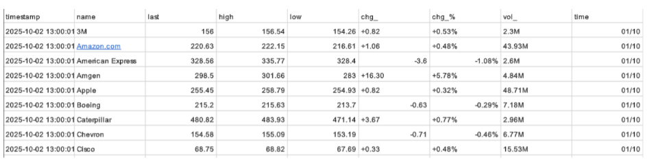

# SBD - Sistemas de Big Data
**Herramientas utilizadas:** 
 - MySQL 
 - Python (pandas) 

## 1. Visualización de datos en SQL

### Tarea 1: Recogida de datos
**Descripción:**  
Hemos obtenido dos ficheros en formato CSV:

stocks.csv: Contiene datos de las principales acciones del mercado estadounidense.

cryptomonedas.csv: Contiene datos de los activos digitales más relevantes.

### Tarea 2: Creación de la BBDD
**Descripción:** 
Para gestionar y consultar esta información de manera eficiente, hemos creado una base de datos relacional que hemos denominado RETO_0. La hemos creado desde la interfaz gráfica de SQL Server..

### Tarea 3: Comprensión de los Datos Recibidos
Una vez almacenados los datos, nuestro equipo ha realizado un análisis exploratorio para familiarizarse con la estructura y el contenido de la información.

 - Conjunto de Datos de la Tabla stocks:

        Este fichero contiene el estado de diversas acciones en un momento concreto. Las columnas clave que hemos identificado son:

        ● name (Texto): El nombre de la compañía (ej. "Amazon.com", "Apple").

        ● last (Numérico): El último precio de cotización registrado.

        ● high/low (Numérico): El precio más alto y más bajo alcanzado en el período.

        ● chg_ (Numérico): El cambio neto en el precio (en dólares). Es un indicador directo de la ganancia o pérdida.

        ● chg_% (Texto): El cambio porcentual en el precio. Muy útil para comparar el rendimiento entre acciones de diferente valor.

        ● vol (Texto): El volumen de negociación, representado con abreviaturas (ej. '2.3M' para 2.3 millones). Indica el nivel de interés o actividad en una acción.

 - Conjunto de Datos de la Tablas cryptomonedas:

        Similar al de acciones, este conjunto nos ofrece una visión del mercado de activos digitales. Las áreas de mayor interés son:

        ● name/symbol (Texto): El nombre completo y el "ticker" o símbolo de la criptomoneda (ej. "Bitcoin", "BTC").

        ● price_usd (Numérico): El precio en dólares estadounidenses.

        ● vol_24h/total_vol (Texto): El volumen negociado en las últimas 24 horas y el volumen total.

        ● chg_24h/chg_7d (Texto): El cambio porcentual en las últimas 24 horas y en los últimos 7 días. Clave para entender tendencias a corto y medio plazo.

        ● market_cap (Texto): La capitalización de mercado, que representa el valor total de todas las monedas en circulación. Es un indicador del tamaño y la relevancia del activo.

### Tarea 4: Planteamiento de Preguntas Clave
Basándonos en nuestra comprensión de los datos y los objetivos del negocio, hemos formulado una serie de preguntas estratégicas. 

Estas preguntas guiarán nuestro análisis y nos ayudarán a extraer información que pueda traducirse en acciones concretas para mejorar la rentabilidad y la toma de decisiones.

 - Preguntas para el Mercado de Acciones:

        1. ¿Cuáles son las acciones con mejor y peor rendimiento reciente para identificar rápidamente las "estrellas" y los "problemas" de nuestra cartera?

        2. ¿Qué acciones se encuentran dentro de un rango de precio específico que pueda ser atractivo para nuevas inversiones?

        3. ¿Cómo podemos clasificar las acciones según su volatilidad para gestionar mejor el riesgo de nuestras posiciones?

        4. ¿Cuál es el sentimiento general del mercado? ¿Hay más acciones al alza o a la baja en un día determinado?

        5. ¿Qué acciones están superando el rendimiento de un referente del mercado como Microsoft, para detectar líderes sectoriales?

 - Preguntas para el Mercado de Criptomonedas:

        1. ¿Qué criptomonedas tienen mayor volumen de negociación? Esto nos indica dónde se concentra el interés de los inversores.

        2. ¿Existen activos que hayan sufrido caídas drásticas recientemente, señalando un posible riesgo o una oportunidad de compra a bajo precio?

        3. ¿Las "stablecoins" (monedas estables) principales mantienen su paridad con el dólar, asegurando la estabilidad de nuestros fondos anclados a ellas?

        4. ¿Qué porcentaje del mercado total dominan los gigantes como Bitcoin y Ethereum? Esto nos ayuda a entender la concentración del mercado.

        5. ¿Qué criptomonedas son actualmente más caras que Ethereum, para comprender el posicionamiento de precios en la gama alta del mercado?
